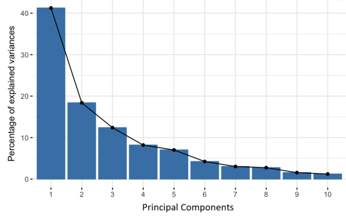
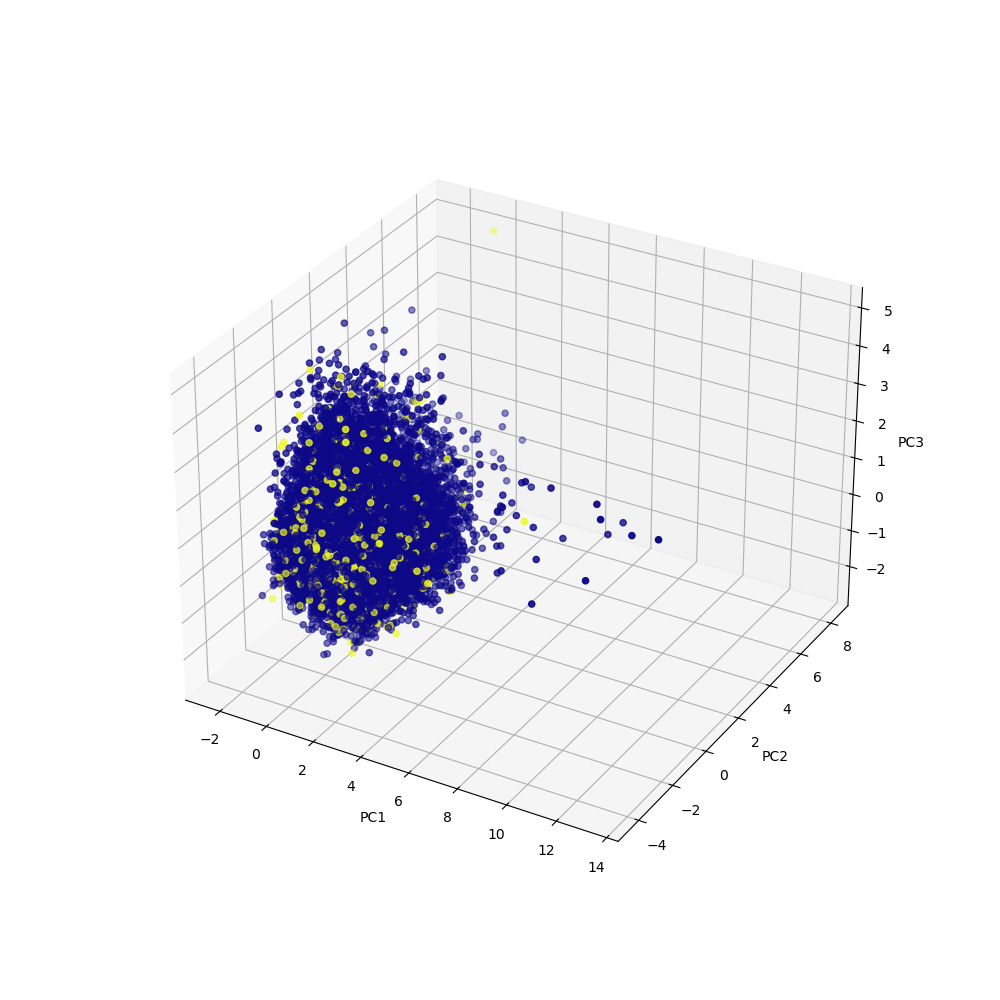

<h1 style="color:DarkTurquoise"> What is PCA </h1> 

See [builtin.com](https://builtin.com/data-science/step-step-explanation-principal-component-analysis) for more information

PCA is a dimensionality reduction technique that is used to reduce the dimensionality
of large data sets, by transforming a large set of variables into a smaller one 
that still contains most of the information in the large set

**NOTE** this comes at the expense of accuracy (we may not want to use 
PCA for our purposes) but improves simplicity and makes analyzing data
points easier for Machine learning algorithms without extraneous variables to 
process

The process is as follows:

<h2 style="color:CornflowerBlue"> Step 1: Standardization </h2> 

---

standardize range of continous initial variables so each of them contributes
equally to the analysis
* pca is very sensitive to variances of initial variables
* This is accomplished by the following formulation

 

$$
z = \frac{x - \mu}{\sigma}
$$

* $z$ is the standardized value, and $x$ is the original data point value

<h2 style="color:CornflowerBlue"> Step 2: Covariance Matrix Computation </h2> 

---
The covariance matrix computation
* want to understand **how variables of input data set vary from mean with respect to each other**
* variables can be highly correlated such that they contain redundant information

The covariance matrix: 
* a $p\times p$ symmetric matrix ($p$ is the number of dimensions)
* has entries associated with all possibel pairs of initial variables

$$
\left[\begin{array}{cc}
    Cov(x,x) & Cov(x,y) & Cov(x,z) \\
    Cov(y,x) & Cov(y,y) & Cov(y,z) \\
    Cov(z,x) & Cov(z,y) & Cov(z,z)
\end{array}\right]
$$

Since the covariance of a variable with itself is its variance $(Cov(a,a) = Var(a))$
* the upper and lower triangle portions are equal (the main diagonal is the )

The covariances give us the following information: (the sign is the metric of interest)
* If positive: two variables increase or decrease together (correlated)
* If negative: one increases when the other decreases (inversely correlated)

<h2 style="color:CornflowerBlue"> Step 3: Compute the Eigenvectors and Eigenvalues of the Covariance Matrix to Identify the Principal Components </h2> 

---
* **Principal Components**:
  * new variables constructed as linear combinations of the intial variables
  * new variables are uncorrelated with each other - most of the information in the initial variables are compressed into first components
    * if you have 10-dimensional data, PCA tries to put maximum possible information in the first component
    * maximum remaining information in second component
    * This continues until you get components like below:

* Please NOTE: Principal components lack interpretability since they are simply linear combinations of the original variables. 
* Geometric explanation:
  * principal components represent the directions of data that explain maximal amount of variance
  * larger variance carried by a line, larger dispersion of data points along it
  
<h3 style="color:LightSalmon"> How PCA Constructs the Principal Components </h3> 

* Principal components are constructed such that the first principal component accounts for the largest possible variance in the data set
* Second principal component is computed in the same way - with the condition that it is uncorrelated with the first principal component

<h3 style="color:LightSalmon"> Eigenvectors and Eigenvalues </h3>

* Eigenvectors and eigenvalues always come in pairs 
  * every eigenvector has an eigenvalue
  * number is equal to the number of dimensions in the data
* Eigenvectors of the covariance matrix - directions of the axes where there is the most variance!
  * eigenvalues - coefficients attached to eiegenvectors
  * give amount of variance carried in each principal component
  * Rank the eigenvectors in order of their eigenvalues (highest to lowest) in order to get the principal components in order of significance!

<h4 style="color:DarkSeaGreen"> Example </h4>

Suppose you have a dataset with 2 variables $x,y$ with eigenvectors and eigenvalues of the covariance matrix as follows:
$$
v1 = \left[\begin{array}{cc} 0.6778736 \\ 0.7351785 \end{array}\right] \mskip{2em} \lambda_{1} = 1.284028 \\
v2 = \left[\begin{array}{cc} -0.7351785 \\ 0.6778736 \end{array}\right] \mskip{2em} \lambda_{2} = 0.04908323
$$
Ranking the eigenvalues in order gives $\lambda_{1} \gt \lambda_{2}$, so $v1$ corresponds to the first principal component. $v2$ corresponds to second principal component.
* divide each egeinvalue by the sum of the eigenvalues in order to get the percent variance accounted for by each component.
* $\lambda_{1}$ carries $96\%$ of the variance
* $\lambda_{2}$ carries $4\%$ of the variance

<h2 style="color:CornflowerBlue"> Step 4: Feature Vector </h2>

---
In this step, we choose whether to keep the components or discard those of lesser significance. The remaining principal components form the feature vector.
* Based on the example above, we could either have discarded $v2$ or kept it along with $v1$
* If you just want to reformat the variables in terms of how much information they carry, then it may not be necessary to get rid of certain variables.

<h2 style="color:CornflowerBlue"> Step 5: Recast data along the principal component axis </h2>

---
* use the feature vector to reorient data from original axes to the ones represented by the principal components
* Can be done by multiplying transpose of original data set by the transpose of the feature vector

$$
FinalDataSet = FeatureVector^{T} * StandardizedOriginalDataset^{T}
$$

<h2 style="color:CornflowerBlue"> My Personal Analysis </h2>

---
Below are some figures detailing the principal component analysis for the `InsNova` data set which 
is being used. They color is mapped to the `clm` response value. As you can see, principal component
analysis and visualization is not especially useful our usecase, especially since the plot seems 
to demonstrate a lot of overlap in the data

**2d-principal components: PC1 and PC2**

 

**3d-principal components: PC1, PC2, and PC3**

